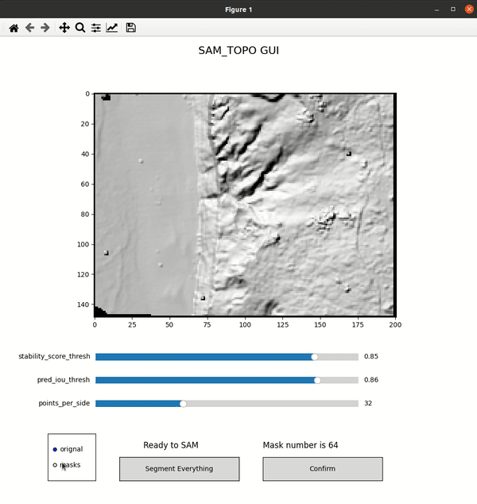
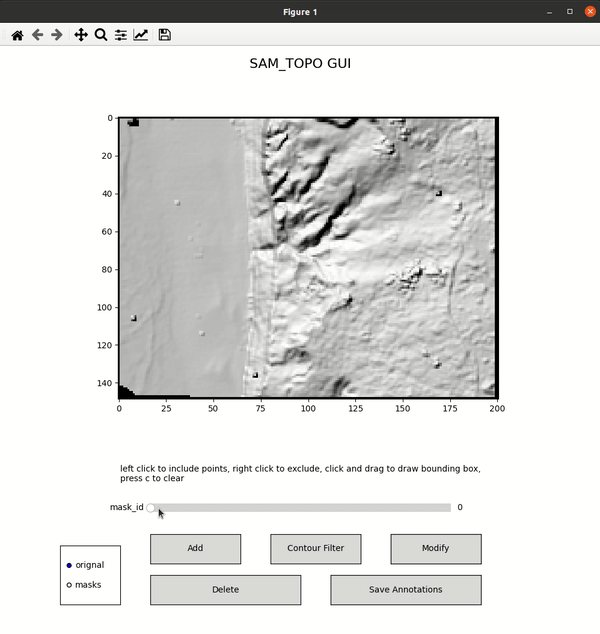
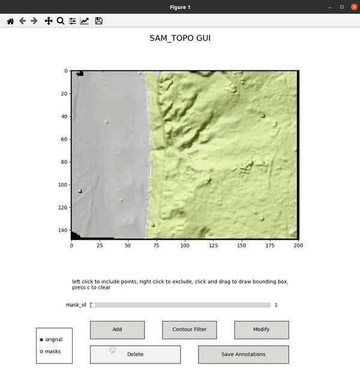
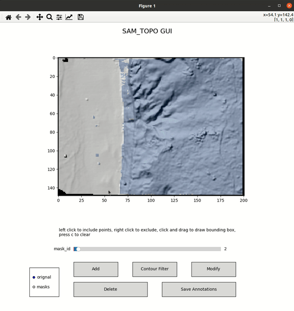

# sam_topo
Segment anything model for topographic data

- easy to costumize: matplotlib-based GUI
- Segment everything first and then interactive segmentation for individual masks


## Installation

Please follow the instructions to install `segment-anything`: https://github.com/facebookresearch/segment-anything.git

Install `sam_topo`:
```
git clone https://github.com/ZhiangChen/sam_topo.git
cd sam_topo
pip install .
```

## Run
1. Run GUI for interactive segmentation 
```
python3 gui.py
```
2. Use the `sam_topo` library
```python
from sam_topo.gui import SAM_Topo_GUI
sam_topo_gui = SAM_Topo_GUI(img_path='../data/data/sample_data/beach_hillshade_grayscale.png', 
                            sam_checkpoint = "../data/models/sam_vit_h_4b8939.pth", 
                            model_type = "vit_h", 
                            is_cuda=True)
```
3. Tiff data preprocessing: SAM requires RGB images. `sam_topo.preprocessing` provides functions to convert tiff data to color or grayscale images. 

## Demo
1. Segment everything
<div align=center>

</div>


2. Visualize individaul mask
<div align=center>

</div>

3. Delete masks
<div align=center>

</div>

4. Modify individaul mask
<div align=center>

</div>